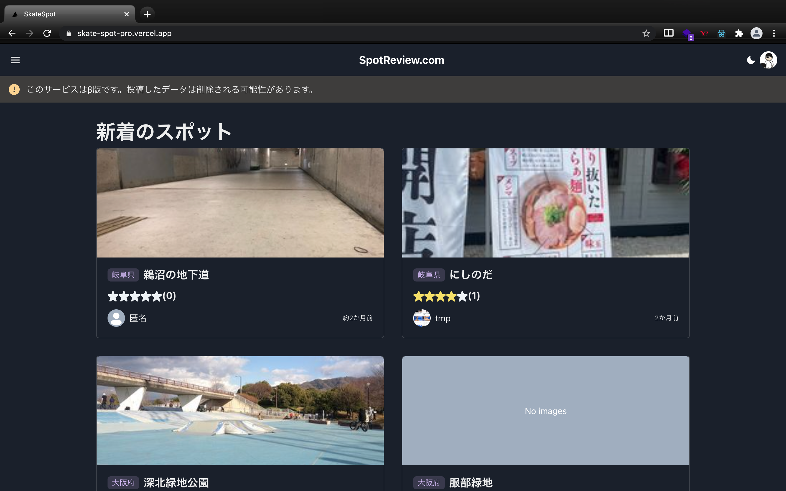
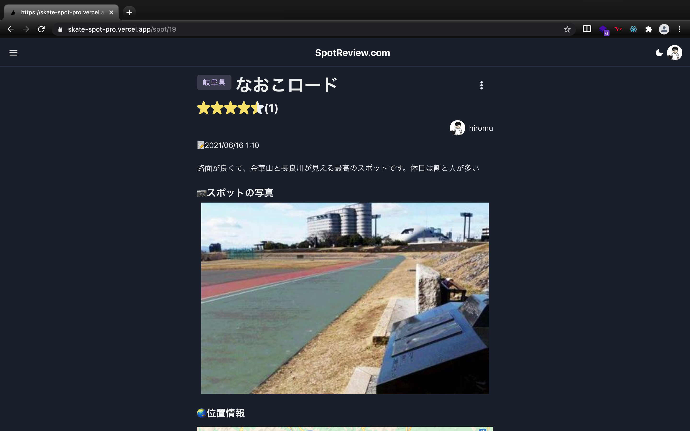

# SkateReview. com🛹🛹
スケートスポットのレビューサイト🛹🛹

You can check out the app on [this url](https://skate-spot-pro.vercel.app/)!!

API ⏩ [skate-spo-api](https://github.com/hiromu617/skate-spot-api)




1. [Features](#Features)
1. [Future features](#Future%20features)
1. [Technology used](#Technology%20used)
1. [Future features](#Future%20features)
1. [Requirement](#Requirement)
1. [Usage](#Usage)

# Features
[Web vitals](https://developers-jp.googleblog.com/2020/05/web-vitals.html)を意識した開発🚀

- スポットの投稿、編集、削除
- スポットへのレビュー
- 地図からスポットを探す
- ログイン, ログアウト(firebase Authentication)
- 匿名投稿、レビュー

# Future features

以下の機能を追加予定。

- [ ] スポットの検索
- [ ] スポットの絞り込み
- [ ] スポットのソート

# Technology used

- React.js 17.0.2
- Next.js 10.2.3
- TypeScript 4.3.2
- Vercel

## library and framewoek

- UIフレームワーク ⏩ [chakra ui](https://chakra-ui.com/)

- httpクライアント ⏩ [axios](https://github.com/axios/axios)

- データフェッチ ⏩ [SWR](https://swr.vercel.app/)

- フォーム ⏩ [react-hook-form](https://react-hook-form.com/)

- 認証、画像ストレージ ⏩ [firebase](https://firebase.google.com/)

- date utility ⏩ [date-fns](https://date-fns.org/)

- rating ⏩ [react-rating](https://github.com/dreyescat/react-rating)
# Requirement

* Node.js 16.3.0


# Usage

0. [API](https://github.com/hiromu617/skate-spot-api)を立ち上げてから以下を実行

1. リポジトリをクローン
```bash
$ git clone https://github.com/hiromu617/skate-spot-app.git
```
2. ディレクトリに移動
```bash
$ cd skate-spot-app
```
3. node_modulesをインストール
```bash
$ yarn
```
4. Run the app
```bash
$ yarn start
```
